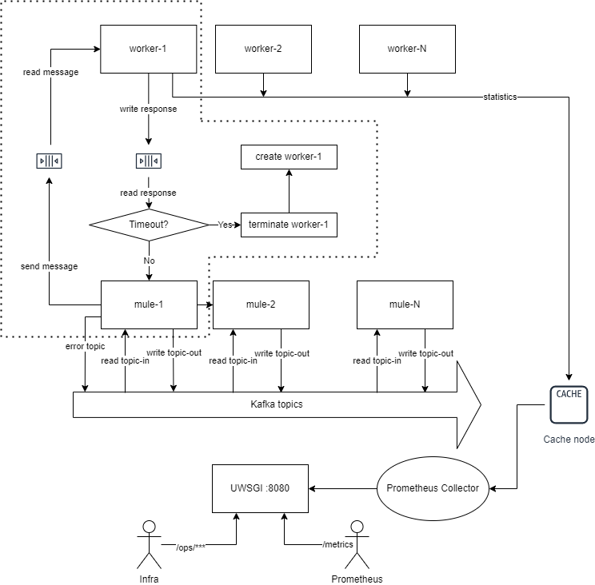

# Kafka microservice

Resilient kafka-microservice with support of prometheus metrics.
It facilitates embedding the essential processor of kafka messages under a framework which automatically handles:
1. Message I/O abstraction (Kafka, HTTP, ...)
2. Workers management
3. Prometheus interface (/metrics)
4. Ops http handlers (/ops/heartbeat, /ops/version)
5. Crash handling
6. Hanging recovery

On initialisation the embedded service provides a list of topics to subscribe and optional error topic.
In the processing body it receives an input topic and message and results an output topic and message.
The framework is encapsulated in the class ServiceWorker which your service needs to inherit.

### Example:

    from kafka_microservice import ServiceWorker

    class DemoWorker(ServiceWorker):
    def __init__(self):
        super().__init__('demo', consumer_args=dict(topics='input-topic', error_topic='error-topic'))

    def process(self, in_topic, message):
        return ('output-topic', message)

    if __name__ == '__main__':
        DemoWorker().start()

Dockerfile can be described as follows:

    FROM kafka-microservice

Add the processing code.

    ADD demo_service.py $APP_DIR

where *$APP_DIR* is env var defined by the base image.

Execute statement:

    CMD [ "uwsgi", "--ini", "uwsgi.ini", "--mule=demo_service.py", "--mule=demo_service.py" ]

where uwsgi.ini is inherited by the framework.
Pass as many *--mule* options as workers are needed to run in paralell inside the container.

### High-level architecture chart

